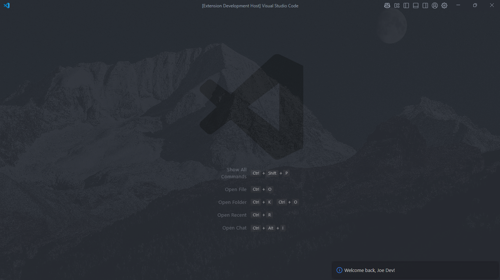

# First Extension - Your Personal VS Code Assistant

<div align="center">
    _A simple yet powerful extension that greets you and remembers your name_

</div>

---

## What does this extension do?

**First Extension** is your personal companion in VS Code that:

- Greets you every time you open the editor
- Remembers your name between sessions
- Allows you to change your name whenever you want
- Can forget your name if you wish

### Screenshot

<div align="center">



_First Extension interface showing the greeting functionality_

</div>

---

## Quick Installation

### Method 1: From VS Code Marketplace

```bash
# Coming soon to the official marketplace
code --install-extension first-extension
```

### Method 2: Manual Installation

1. Download the `.vsix` file
2. Open VS Code
3. Press `Ctrl+Shift+P`
4. Search for "Extensions: Install from VSIX"
5. Select the downloaded file

---

## Available Commands

| Command           | Description                    | Shortcut                  |
| ----------------- | ------------------------------ | ------------------------- |
| `Greet user`      | Greets you and saves your name | `Ctrl+Shift+P` → "Greet"  |
| `Change username` | Changes your saved name        | `Ctrl+Shift+P` → "Change" |
| `Delete UserName` | Removes your name from storage | `Ctrl+Shift+P` → "Delete" |

### How to Use

#### First Use

```
1. Open VS Code
2. The extension will ask if you want to add your name
3. Click "Add Name"
4. Type your name
5. Done! You're now registered
```

#### Change Name

```
1. Press Ctrl+Shift+P
2. Search for "Change username"
3. Type your new name
4. Updated!
```

#### Delete Data

```
1. Press Ctrl+Shift+P
2. Search for "Delete UserName"
3. Confirm the action
4. Your data has been removed
```

---

## Development and Contribution

### Project Structure

```yaml
first-extension/
├── src/
│   ├── commands/
│   │   ├── greet.js         # Greeting command
│   │   ├── changeName.js    # Name change functionality
│   │   ├── deleteName.js    # Data deletion
│   │   └── index.js         # Exports
│   └── utils/
│       └── constants.js     # Global constants
├── public/
│   ├── film.mp4             # Demo video
│   └── screenshot.png       # Extension screenshot
├── extension.js             # Entry point
├── package.json             # Configuration
└── README.md                # This file
```

### Development Setup

```bash
# Clone the repository
git clone https://github.com/Javi-CD/vscode-hello-coder
cd vscode-hello-coder

# Install dependencies
npm install

# Run in development mode
F5 # Opens a new VS Code window with the extension loaded
```

### Testing

```bash
# Run tests
npm test

# Linting
npm run lint
```

---

## Technical Features

### Specifications

- **Minimum VS Code version:** 1.101.0
- **Category:** Other
- **Activation:** Automatic on VS Code startup
- **Storage:** VS Code Global State
- **Compatibility:** Windows, macOS, Linux

### Privacy and Security

- Data stored locally only
- No information sent to external servers
- Easy personal data deletion
- Open source and auditable code

---

## Contributing

If you want to contribute to the project you can read the file [CONTRIBUTING.md](./CONTRIBUTING.md)

### Report Bugs

Found a problem? [Create an issue](https://github.com/Javi-CD/vscode-hello-coder/issues) with:

- Detailed description
- Steps to reproduce
- System information
- Screenshots (if applicable)

---

## Support and Contact

### Need Help?

- [Direct Contact](javierperezdeveloper@gmail.com)
- [GitHub](https://github.com/Javi-CD/)

---

## License

This project is licensed under the MIT License. See the [LICENSE](./LICENSE) file for details.

---

<div align="center">

### Thank you for using First Extension!

---

**Made with ❤️ for Javi-CD**

</div>
